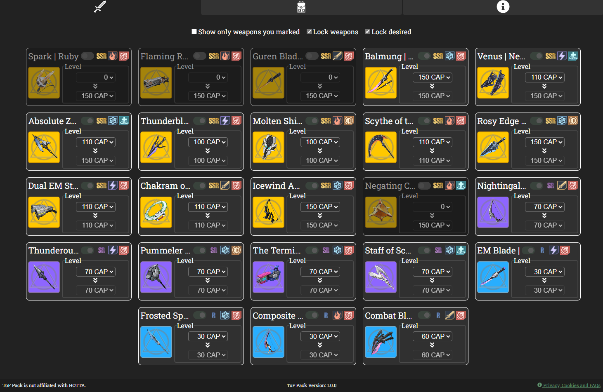
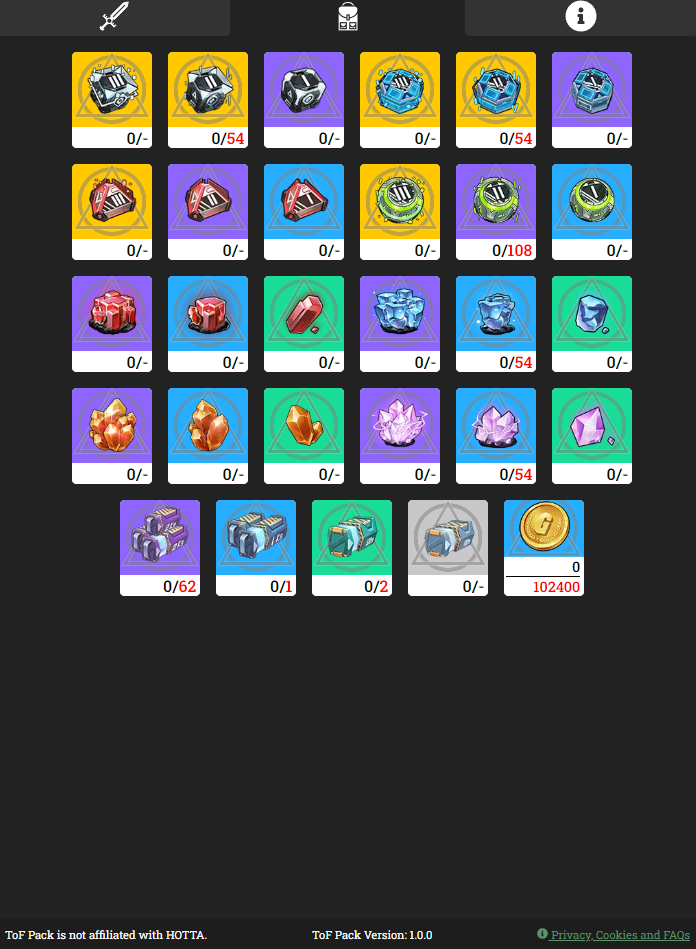

# 	:tokyo_tower::school_satchel: ToF Pack - Tower of Fantasy Resource Management :chart_with_upwards_trend:

An open-source web fansite to help Tower of Fantasy players manage their resources and plan their account progression.

## :hammer: Status

> :green_circle: Online (Github Pages): https://blowita.github.io/tof-pack/ [version 1.0.0]

> :construction: Upcoming: [roadmap](./roadmap.md) :wrench:

## :bookmark: Content Table
<!--ts-->
  * [App Interface](#newspaper-app-interface)
  * [Technologies](#books-technologies)
  * [Contributing](#hand-how-to-contribute)
  * [Install and Run Locally](#calling-installing-and-running-this-project-locally)
  * [Author and License](#memo-author-and-license)
<!--te-->

## :newspaper: App Interface

<details>
  <summary>Weapon page</summary>
  <p align="center">
    
  </p>
</details>
<details>
  <summary>Resources page</summary>
  <p align="center">
    
  </p>
</details>

## :books: Technologies

- [NodeJS](https://nodejs.org/)
- [Yarn](https://yarnpkg.com/)
- [React](https://reactjs.org/)
- [Recoil](https://recoiljs.org/)
- [Styled Components](https://styled-components.com/)
- [Polished](https://polished.js.org/)
- [TypeScript](https://www.typescriptlang.org/)

## :hand: How to contribute

This is an open source project, feel free to submit suggestions and bug reports at the [Issues page](https://github.com/blowita/tof-pack/issues), or make a [Pull Request (PR)](https://github.com/blowita/tof-pack/pulls) if you feel like helping with coding. Also, feel free to fork, clone or copy parts of the project to use on your own projects.

## :calling: Installing and running this project

### :wrench: Prerequisites

Before starting, make sure you have [Git](https://git-scm.com/), [Node](https://nodejs.org/en/) and [Yarn](https://yarnpkg.com/) installed.

### :inbox_tray: Install and run

Clone the project using Git, install its dependencies through Yarn and run the project:

```bash
git clone https://github.com/blowita/tof-pack.git

# wait for git to finish clonning the project, then navigate to the folder and install the dependencies:

cd tof-pack
cd web

yarn

# Finally, run the app:

yarn start
```

The app will be served locally at http://localhost:3000/tof-pack.

## :memo: Author and License

[](https://github.com/blowita/blowita) | [BlowITA](https://github.com/blowita/blowita)
-|-

[](LICENSE)

This project was something I developed in order to learn Facebook's [Recoil library](https://recoiljs.org/) and to practice CSS and styled-components. This helped me identify multiple points that I can improve in future projects (specially in state management and componentization).
